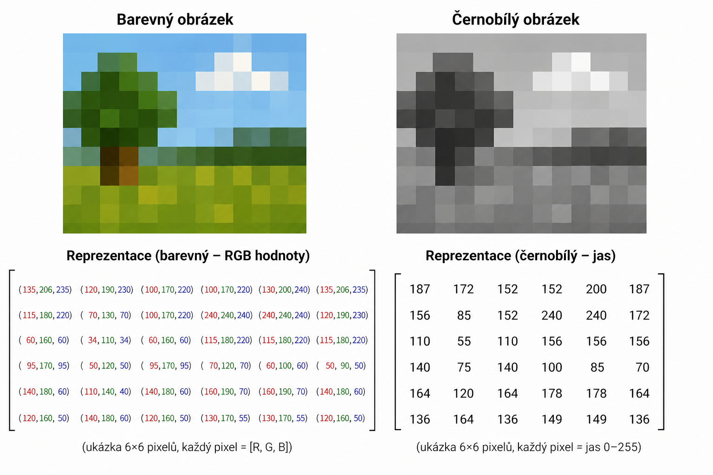
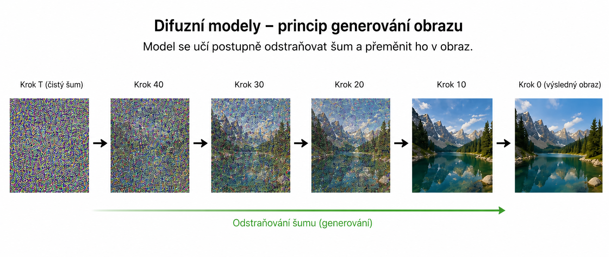
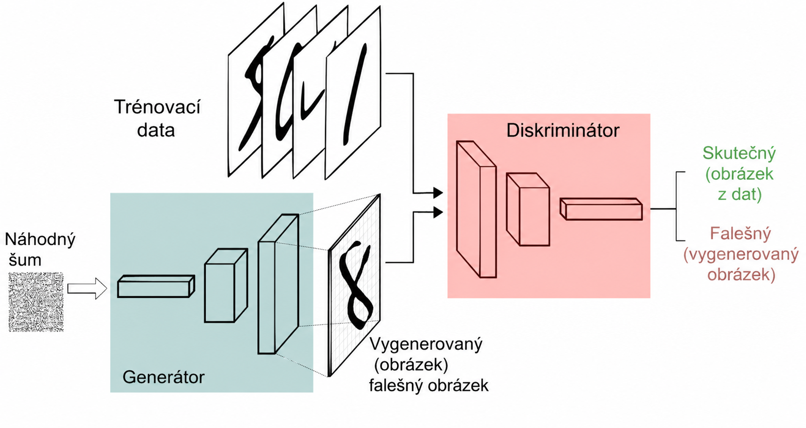
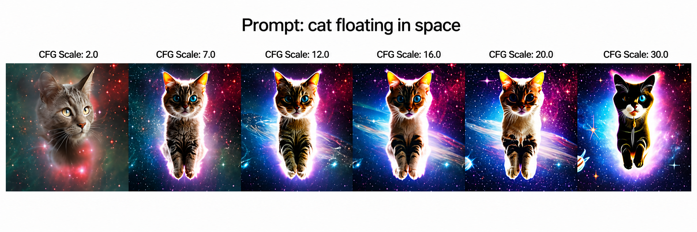
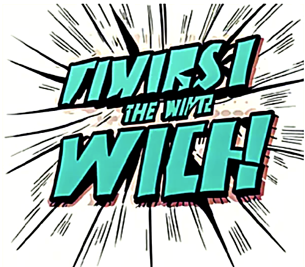
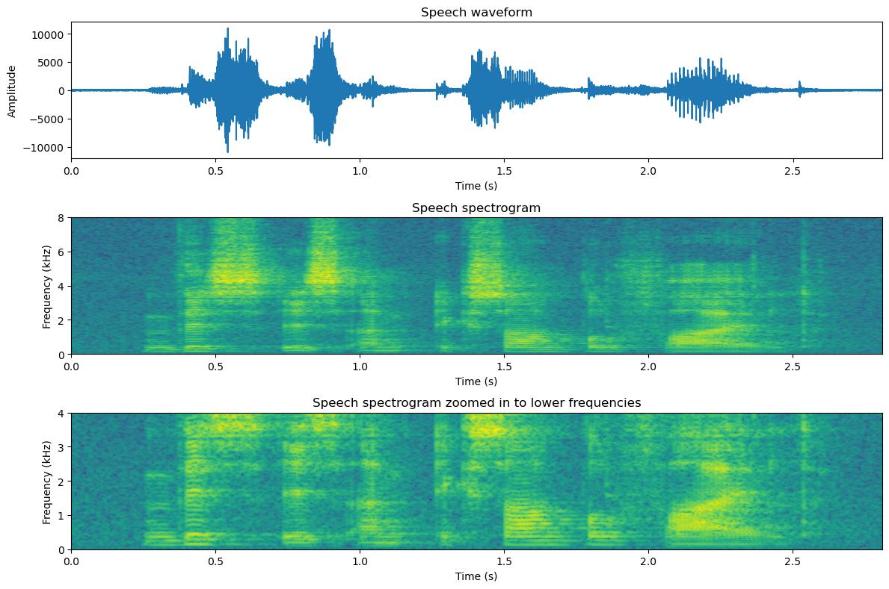

# Generování obrázků

## Jak počítač vnímá obrázek

- Obrázek = mřížka pixelů (malých bodů)
- Každý pixel má číselnou hodnotu (např. RGB: červená, zelená, modrá)
- Počítač nevidí „kočku“, ale čísla (např. [255, 0, 0] = červená)
- Algoritmy hledají vzory (hrany, tvary, barvy)

<p>
  
</p>


## Difuzní modely
dnes nejpoužívanější přístup pro generování obrázků z textu (např. Stable Diffusion, DALL·E)
princip: začne se náhodným šumem → postupně odšumuje → vznikne obraz
model se učí opačný proces k „rozšumění“ obrazu
každý krok = malá oprava (víc struktury, víc detailu)
používá neuronovou síť (často U-Net)
učí se odhadnout šum (ε) a odečíst ho
trénink: přidávám šum do reálných obrázků a učí model ho odstranit
generování: reverzní proces

<p>
  
</p>

## Latentní difuze
problém: obrázky mají hodně dat (např. 512×512×3) → pomalé
řešení: pracovat v latentním prostoru (komprimovaná reprezentace)

proces:

- obrázek → encoder → menší reprezentace
- difuze probíhá v tomto prostoru
- decoder → zpět na obrázek
- výrazně rychlejší a efektivnější
- používá se např. ve Stable Diffusion
- typicky kombinace s VAE


## GAN (Generative Adversarial Networks)
dvě neuronové sítě proti sobě:
generátor → vytváří obrázky
discriminátor → říká real vs fake
trénink = „hra“:
generátor se snaží oklamat diskriminátor
diskriminátor se zlepšuje v rozpoznávání

výsledek:

generátor se naučí generovat realistická data

<p>
  
</p>

## VAE (Variational Autoencoder)
pracuje s latentním prostorem
skládá se ze dvou částí:
encoder → komprese
decoder → rekonstrukce
generování:
sample z latentního prostoru → dekódování → obraz
výhoda:
dobře strukturovaný latentní prostor
nevýhoda:
často méně ostré obrázky než diffusion/GAN


## Jak funguje generování obrázků z promptu

klíčová myšlenka: propojení textu a obrazu přes společný prostor (embeddingy)

proces:

1. text → embedding
   - prompt („kočka sedící na gauči“) se převede na vektor čísel
   - to dělá jazykový model (transformer)
   - výstup = reprezentace významu textu

2. embedding se použije při generování
   - u diffusion modelů se přidá k obrazu v každém kroku
   - pomocí cross-attention
   - model se ptá:
     „jak mám upravit tenhle šum, aby odpovídal textu?“

3. cross-attention
   - propojuje text a obraz
   - model se dívá:
     - na aktuální obraz (resp. šum)
     - na jednotlivá slova promptu
   - a rozhoduje:
     - kde má být „kočka“
     - kde „gauč“
     - jaké barvy, styl, kompozice

4. classifier-free guidance
   - trik pro lepší řízení generování
   - model generuje:
     - jednou bez promptu
     - jednou s promptem
   - rozdíl se zesílí → silnější vliv promptu

<p>
  
</p>

výsledek:
- obrázek postupně „vzniká“ ze šumu
- text ho neřídí přímo, ale ovlivňuje každý krok


### Text v obrázcích

dřív problém:
- model viděl text jen jako obrazec pixelů
- „A“ nebylo písmeno, ale jen tvar
- výsledky: nesmyslné znaky, deformace


<p>
  
</p>

dnes zlepšení:

1. lepší trénovací data
   - obrázky + přesné textové popisy
   - OCR (optical character recognition)
   - model vidí:
     - jak text vypadá
     - co znamená

2. propojení s jazykovými modely
   - text není jen vizuální pattern
   - ale sekvence znaků s významem
   - model chápe rozdíl:
     - „hello“ ≠ „hlelo“

3. lepší architektura (attention)
   - přesnější mapování:
     - slovo → konkrétní část obrázku
   - stabilnější generování znaků

4. multimodální trénink
   - modely trénované na:
     - text + obraz
     - text + obraz + OCR
   - silnější vazba mezi jazykem a vizuální reprezentací

5. (někdy) post-processing
   - obraz se vygeneruje bez textu
   - text se doplní jiným modelem


## Generování zvuku

### Jak je reprezentován zvuk
- zvuk = signál v čase
- reprezentace:
  - sekvence čísel (amplituda)
  - např. hodnoty od -1 do 1
- sampling (vzorkování):
  - např. 44 100 hodnot za sekundu

→ zvuk = pole čísel

<p>
  
</p>

### Text-to-Speech (TTS)

vstup: text  
výstup: zvuk (waveform)

proces:
1. text → embedding
2. model generuje audio signál
3. výstup = sekvence čísel → reproduktor

moderní přístup:
- neuronové sítě (např. diffusion / autoregresní)
- učí se z:
  - text
  - audio
  - speaker (hlas)

vlastnosti:
- intonace
- emoce
- styl hlasu


### Speech-to-Text (STT)

vstup: zvuk  
výstup: text

proces:

1. waveform → spektrogram
   - „obrázek zvuku“
   - osa X = čas
   - osa Y = frekvence

2. model:
   - hledá vzory ve spektrogramu

3. generuje text token po tokenu

klíčová věc:
- attention
  - model se dívá na různé části zvuku
  - při generování konkrétního znaku


### Generování hudby

**Cíl:** vytvořit novou sekvenci zvuku nebo hudební struktury

---

## Přístupy

### 1. Autoregresní modely
- generují hudbu postupně (nota po notě / token po tokenu)
- podobné generování textu
- často založené na transformerech (např. :contentReference[oaicite:0]{index=0})

**Výhody:**
- dobrá kontrola nad strukturou
- zachycení dlouhodobých závislostí (melodie, harmonie)

**Nevýhody:**
- pomalejší generování
- většinou pracují se symbolickou reprezentací (např. MIDI)

---

### 2. Difuzní modely
- začínají náhodným šumem
- postupně ho transformují na hudbu

např. :contentReference[oaicite:1]{index=1}

**Výhody:**
- vysoká kvalita zvuku
- realistický audio výstup

**Nevýhody:**
- horší kontrola struktury
- výpočetně náročné

---

### 3. Latentní modely
- nejdřív komprimují audio do latentního prostoru
- generují v tomto zjednodušeném prostoru
- pak dekódují zpět na zvuk

např. :contentReference[oaicite:2]{index=2}

**Výhody:**
- efektivnější než práce s raw audiem
- kombinují výhody různých přístupů

---

## Reprezentace hudby

Hudbu lze modelovat různými způsoby:

### 1. MIDI (symbolická reprezentace)
- noty, délky, velocity
- strukturované a přehledné
- vhodné pro transformery

MIDI neobsahuje zvuk, ale instrukce:

```plaintext
Time  Event         Note   Velocity
0     Note ON       C4     100
480   Note OFF      C4     0

480   Note ON       D4     100
960   Note OFF      D4     0

960   Note ON       E4     100
1440  Note OFF      E4     0
```

### 2. Spektrogram
- vizuální reprezentace zvuku (frekvence v čase)
- často používané u GAN a difuzních modelů

### 3. Raw audio (waveform)
- přímo zvukový signál
- nejrealističtější, ale výpočetně náročné

---

## Generování videí

video = sekvence obrázků v čase

problém:
- nestačí generovat jednotlivé obrázky
- musí být:
  - konzistentní
  - plynulé


### Starší přístup: frame-by-frame
- generuje se každý snímek zvlášť
- problém:
  - flickering (blikání)
  - měnící se objekty


### Moderní přístup: spatio-temporal diffusion

- generuje se celé video najednou
- model pracuje:
  - v prostoru (obraz)
  - i v čase

výhody:
- konzistence
- stabilní objekty
- plynulý pohyb


### Jak to funguje

- video → latentní reprezentace
- diffusion probíhá v tomto prostoru
- model generuje:
  - všechny snímky zároveň
  - s ohledem na časové vztahy

často kombinace:
- diffusion → kvalita obrazu
- transformer → časové vztahy


## Generování audio + video dohromady

problém:
- synchronizace:
  - pohyb rtů
  - zvuk
  - akce

řešení:

1. společný latentní prostor
   - jedna reprezentace pro:
     - obraz
     - zvuk

2. dva decodery:
   - video decoder
   - audio decoder

→ výstup je synchronizovaný

alternativy:
- video → audio
- audio → video (lip sync)
- joint diffusion
  - generuje oboje zároveň


## Multimodální modely

modely pracující s více typy dat:

příklady:
- text + obraz
- text + audio
- text → video + zvuk

princip:
- všechno se převádí na vektory
- model se učí společné vztahy


## Shrnutí

- všechno je reprezentováno jako čísla
- model se učí pravděpodobnostní rozdělení dat
- generování = vzorkování z tohoto rozdělení

rozdíl mezi médii:
- text → sekvence tokenů
- obraz → 2D struktura
- audio → signál v čase
- video → obraz + čas
