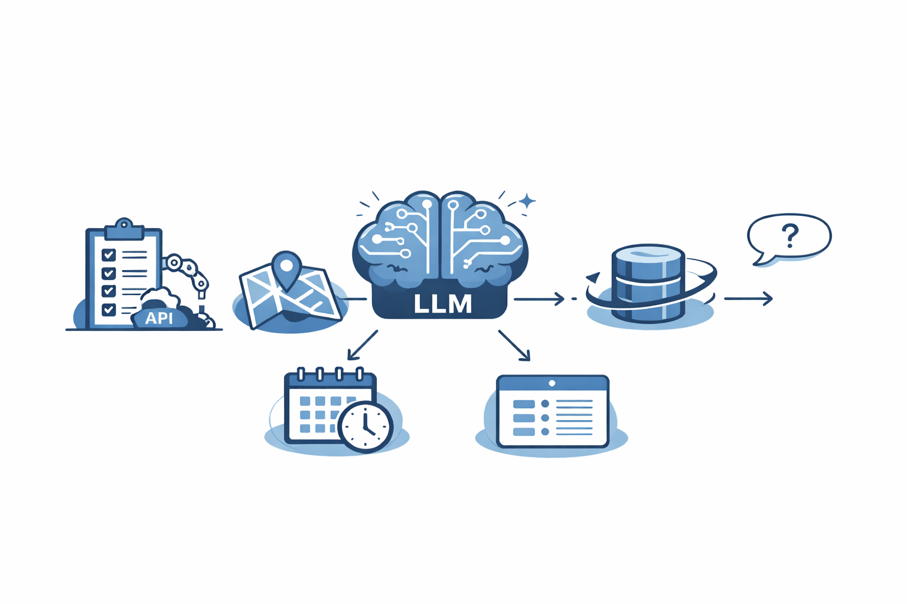
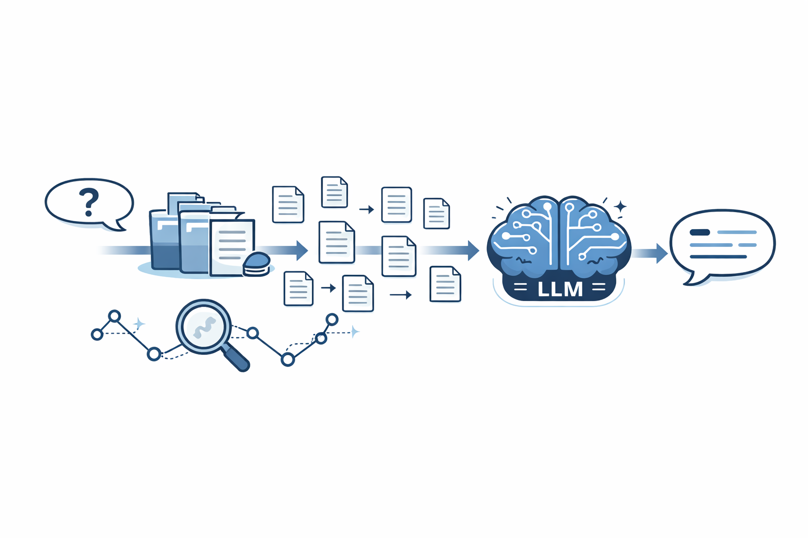
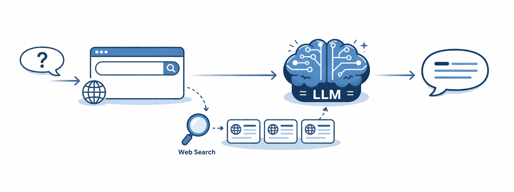
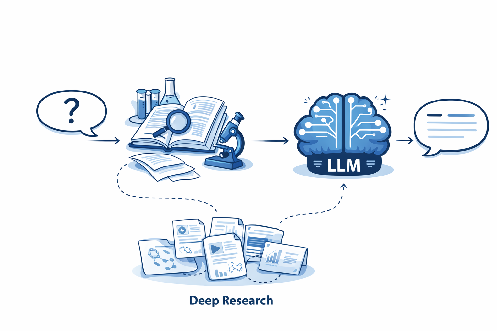
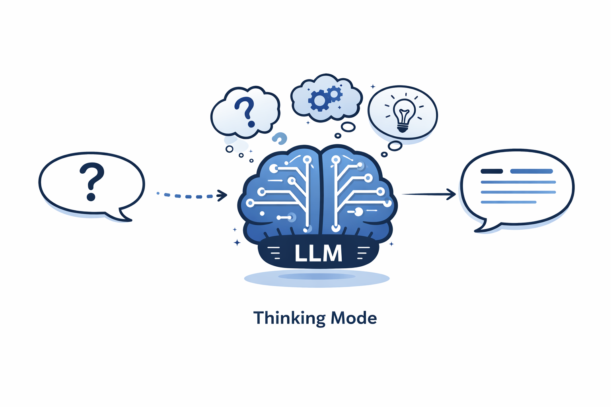
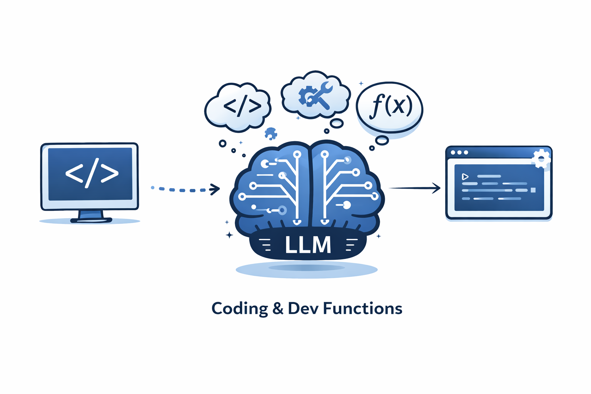
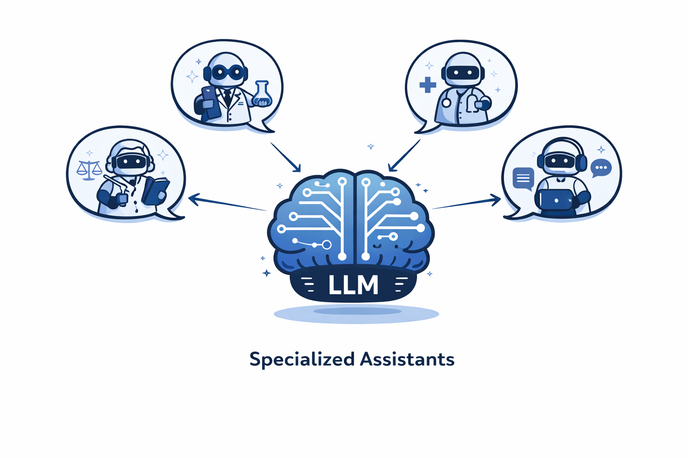

# Přehled funkcí moderních LLM systémů


## Úvod

Moderní LLM systémy dnes nepředstavují pouze samotné jazykové modely,
ale celé ekosystémy funkcí a rozšíření, které výrazně rozšiřují jejich
schopnosti. Nejde tedy o „nový model", ale o kombinaci modelu, nástrojů,
dat a infrastruktury kolem něj. Tyto systémy umožňují pracovat s
aktuálními informacemi, firemními daty nebo externími službami. Díky
tomu se LLM stávají prakticky využitelnými v reálném světě, ať už ve
firmách, vzdělávání nebo vývoji softwaru.
<p>
  
</p>

## RAG (Retrieval-Augmented Generation)

RAG je architektura, která kombinuje vyhledávání informací s generováním
odpovědí. Místo toho, aby model odpovídal pouze na základě svých
trénovacích dat, nejprve si najde relevantní informace (např. v
dokumentech nebo databázích) a teprve poté vytvoří odpověď. Tento
přístup výrazně zvyšuje přesnost a umožňuje pracovat s aktuálními nebo
specifickými daty.

Technicky se data dělí na menší části (tzv. chunky), které se převádějí
na embeddingy a ukládají do vektorové databáze. Při dotazu se vyhledají
nejrelevantnější části pomocí podobnosti vektorů (např. cosine
similarity) a ty se následně použijí jako kontext pro model.

```json
{
  "text": "obsah chunku...",
  "vektor": [0.12, 2.6, 4.3 ,...]
}
```

-   kombinace retrieval + generation
-   práce s chunky a embeddingy
-   využití vektorových databází
-   vyšší přesnost a aktuálnost

<p>
  
</p>


```text
[INSTRUKCE]
Odpověz na základě kontextu

[KONTEXT]
chunk A
chunk B
chunk C

[DOTAZ]
Jak funguje caching v redisu?
```

## Web Search

Web search umožňuje modelu získat aktuální informace z internetu. Pokud
model vyhodnotí, že dotaz vyžaduje aktuální data (např. počasí nebo
novinky), převede dotaz na vyhledávací query a použije API vyhledávače
(např. Google nebo Bing). Následně vybere relevantní zdroje, extrahuje z
nich obsah a vytvoří syntetickou odpověď.

Celý proces je velmi podobný RAG - webové stránky se rozdělí na chunky
a ty se použijí jako kontext. Rozdíl je v tom, že zdrojem dat je
internet místo interní databáze.

```json
 {
  "tool": "web_search",
  "query": "weather Prague today"
}
```

-   získávání aktuálních informací
-   práce s vyhledávacími API
-   výběr důvěryhodných zdrojů
-   syntéza více zdrojů

<p>
  
</p>

## Deep Research

Deep research je pokročilý režim, který simuluje práci výzkumníka. Místo
jednorázového vyhledání informací model rozloží problém na menší části,
postupně je analyzuje a iterativně hledá další informace. Výsledky si
ukládá do tzv. working contextu a na konci provede syntézu.

Tento přístup je pomalejší, ale výrazně přesnější. Používá se zejména
pro komplexní témata, analýzy nebo strategické rozhodování.

-   rozklad dotazu na podotázky
-   iterativní vyhledávání
-   ukládání mezivýstupů
-   syntéza a ověřování

<p>
  
</p>


## Shopping Research

Shopping research je specializovaná forma deep research zaměřená na
produkty. Model zde porovnává různé možnosti, analyzuje parametry, ceny
i recenze a snaží se doporučit nejlepší variantu pro uživatele.

## Thinking Mode (Reasoning)

Thinking mode (nebo reasoning mode) je zaměřen na vnitřní uvažování
modelu. Model si zde rozepisuje mezikroky řešení (chain-of-thought), což
mu pomáhá lépe řešit komplexní úlohy, zejména logické nebo matematické.

Důležité je, že model tím nezískává nové informace - pouze lépe pracuje
s těmi, které už má. Tento přístup ale může selhat, pokud dojde k chybě
v některém mezikroku.

-   chain-of-thought přístup
-   rozklad problému na kroky
-   lepší přesnost u složitých úloh
-   riziko overthinkingu

<p>
  
</p>

## Zapisování do souborů

LLM samotné neumí vytvářet soubory - umí pouze generovat text. Pokud
chceme vytvořit například PDF nebo DOCX, je potřeba použít externí
nástroj, který tento text převede do souboru.

Model tedy generuje strukturu a obsah, zatímco systém kolem něj
zajišťuje samotné vytvoření souboru.

```json
 {
  "tool": "create_pdf",
  "query": "obsah souboru.."
}
```

## Coding a Dev funkce

LLM se velmi často používají pro práci s kódem. Speciálně trénované
modely dokáží generovat, upravovat i vysvětlovat kód. Díky znalosti
syntaxe a programátorských patternů jsou schopné pomáhat s vývojem
aplikací.

Důležitým rozdílem oproti běžnému textu je, že kód má striktní pravidla
- i malá chyba může způsobit nefunkčnost. Proto jsou tyto modely
optimalizované na přesnost.

-   generování a úprava kódu
-   debugging a testování
-   práce s projekty
-   vysoká přesnost syntaxe

<p>
  
</p>


## Specializovaní asistenti

Specializovaní asistenti jsou přizpůsobené verze LLM pro konkrétní úkoly
nebo domény. Nejde o nové modely, ale o kombinaci modelu, instrukcí, dat
a nástrojů.

Typicky obsahují systémové instrukce (jak se má model chovat), kontext
(např. firemní data) a nástroje (API, web search). Díky tomu mohou být
výrazně efektivnější v konkrétní oblasti.

-   kombinace LLM + konfigurace
-   doménové zaměření
-   využití RAG a nástrojů
-   možnost publikace a sdílení

<p>
  
</p>


## Apps

Apps představují napojení LLM na externí služby. Umožňují modelu
pracovat s daty mimo samotný chat, provádět akce nebo komunikovat s
jinými systémy.

Tyto aplikace definují API, přes které model získává data nebo provádí
operace. Neobsahují instrukce jako prompt, ale spíše rozhraní a
oprávnění.

-   integrace externích služeb
-   práce s API
-   přístup k datům mimo chat
-   rozšíření schopností LLM
