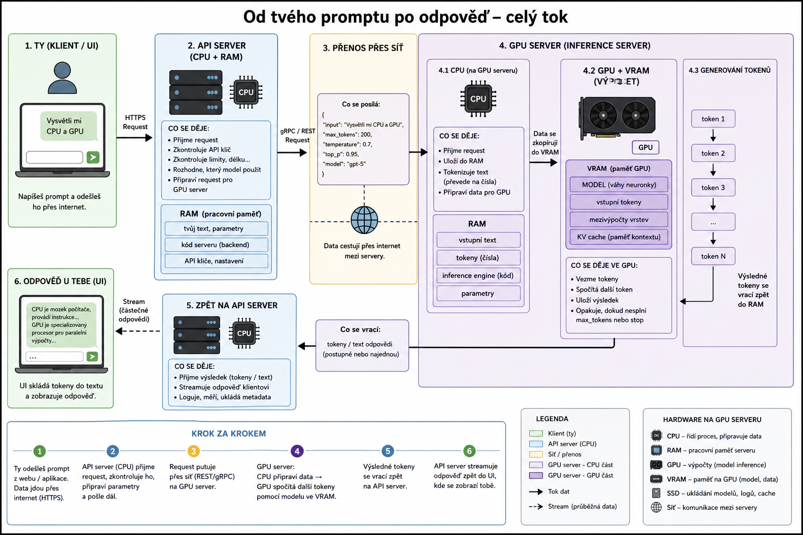

# Přednáška 2: LLM infrastruktura

## 1. Cesta requestu

1. Uživatel zadá prompt (frontend)
2. Odešle se HTTP request (JSON)
3. API gateway:
   - validace
   - autentizace
   - rate limiting
4. Backend:
   - orchestrace
   - přidání kontextu
   - batching
5. GPU server:
   - tokenizace
   - inference
6. Odpověď zpět uživateli

---

## 2. Architektura

### Frontend
- běží v prohlížeči / mobilu
- posílá request

### Backend
- API gateway
- auth service
- orchestration

### Model server
- běží na GPU
- provádí inference

---

## 3. API request

```json
{
  "model": "gpt-4.1",
  "input": "Napiš vtip",
  "temperature": 0.7,
  "max_tokens": 200
}
```
<p>
  
</p>